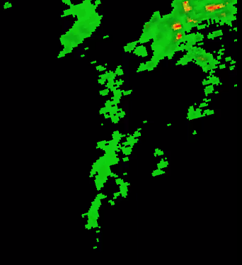

# Build an Animation #



```python
import requests
from multiprocessing import Pool
from PIL import Image
import os
import time

def do_download(arg):
    url, fname = arg
    print(url)
    c = requests.get(url)    
    with open(fname,'wb') as f:
        f.write(c.content)

args = []
minx = 32
maxx = 33
miny = 46
maxy = 47
zoom = 7

now = time.mktime(time.strptime("20211125.0100","%Y%m%d.%H%M"))

vtimes = [time.strftime("%Y%m%d.%H%M", time.gmtime(now + hr*3600)) for hr in range(4)]
for vtime in vtimes:
    for x in range(minx, maxx+1):
        for y in range(miny, maxy+1):
            url = f"https://wxroutingapp.azurewebsites.net/fcst_tile/hrrr.TMP.surface/{vtime}/{x}/{y}/{zoom}?token=fc"
            fname = f"/home/blambi/tmp/{vtime}.{x}.{y}.png"
            args.append([url, fname])
            
with Pool(8) as p:
    p.map(do_download, args)
p.join()

w,h = (maxx-minx+1) * 256, (maxy-miny+1) * 256

fnames = []
for vtime in vtimes:
    im = Image.new('RGBA',(w,h))
    for i,x in enumerate(range(minx, maxx+1)):
        for j,y in enumerate(range(miny, maxy+1)):
            _x = i*256
            _y = j*256
            fname = f"/home/blambi/tmp/{vtime}.{x}.{y}.png"
            _im = Image.open(fname)
            im.paste(_im, (_x, _y))
    ofname = f"/home/blambi/tmp/im_{vtime}.png"
    im.save(ofname,'PNG')
    fnames.append(fname)

cmd = f"/usr/bin/ffmpeg -y -framerate 6 -pattern_type glob -i '/home/blambi/tmp/im_*.png' -c:v libx264 -r 30 /home/blambi/tmp/out.mp4"
print(cmd)
os.system(cmd)
```
