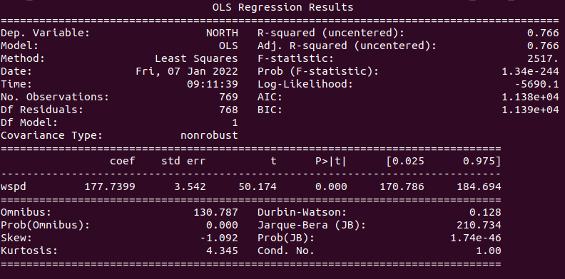

# Build a Power Prediction Model #

Using power production data from Texas wind farms (http://www.ercot.com/gridinfo/load/load_hist/), lookup historical wind speed data and train a power prediction model.  This example shows how the data downloaded from our API is ready to be used in a Machine Learning scenario with very little effort.

The data file required can be downloaded here: [Native_Load_2021.csv](Native_Load_2021.csv)

First import all the tools we will need, these should be available through pip or conda

```python
import xarray as xr
import pandas as pd
import statsmodels.api as sm
import requests
import numpy as np
```
Next make a HTTP request to our API using a begin time and end time for one point, download the results and save to a temp file, open the temp file as netcdf

```python
# notice the timestamps in the URL, pulling one month of data
url = f"https://wxroutingapp.azurewebsites.net/histdata/20210101.0000/20210201.0000?latlons=[[32.901,-97.039]]"
out_fname = "data.nc"
c = requests.get(url)
with open(out_fname,"wb") as f:
    f.write(c.content)
	
ds = xr.open_dataset(out_fname)
data = ds.variables['data'].values
```

Convert the valid times to pandas timestamp

```python
vtimes = pd.to_datetime(ds.variables['vtime'].values*1e9)
```

Load in power production data downloaded from ERCOT website, then fix the timestamps on this dataset

```python
df = pd.read_csv("Native_Load_2021.csv") #load texas power data
    
#need to fix their weird timestamps
df['hr'] = df['Hour Ending'].str.slice(11,13)
df['day'] = df['Hour Ending'].str.slice(0,10)
df['ihr'] = df['hr'].astype(int)
df['ihr'] = [f'{i:02d}' for i in (df['ihr'] - 1)]
df['time_str'] = df['day'].str.cat(df['ihr'])
df['time'] = pd.to_datetime(df['time_str'], format='%m/%d/%Y%H')
```

Because the endpoint supports multiple points but we provided only one, the 'point' dimension has length 1, the 'var' dimension we grab the last one because that is wspd

```python
dfw_data = data[-1,-1,:] #gives us wspd time series for the one point
dfw_data = np.array([dfw_data, vtimes]) #put it with the valid times
dfw_data = np.rollaxis(dfw_data, 1, 0) #rotate the array to be in pandas row format
dfw_df = pd.DataFrame(dfw_data, columns=['wspd','time']) #make a new dataframe with 'time' column for joining with obs
```
Now match the downloaded historical data with the observations based on time column, pull out the predictor (wspd) and predictand (NORTH power production)
```python
match = pd.merge_asof(dfw_df, df, on='time') #match observations with forecast based on time
match = match.dropna() #clean up empty 

X = match["wspd"].astype(float)
y = match["NORTH"].astype(float)
```

Finally the matched data can be used to train a regression model and print the results

```python
model = sm.OLS(y, X).fit()
predictions = model.predict(X)
    
print(model.summary())
```


