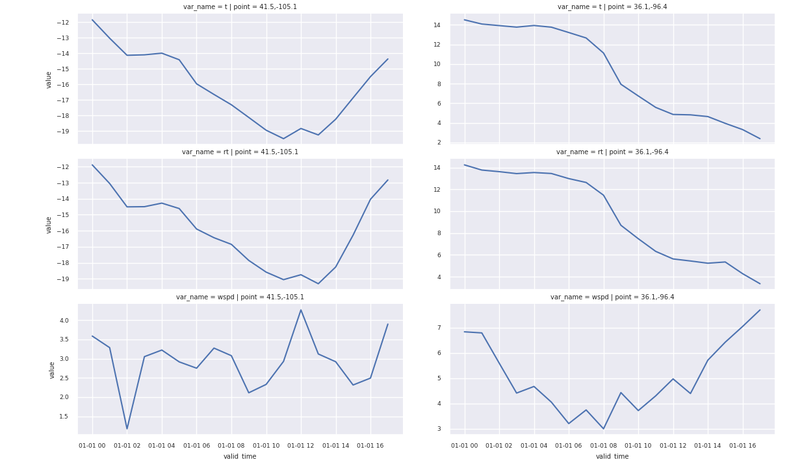

## Make a point request and display a plot ##

The goal of this tutorial is to demonstrate querying two lat/lon points for the current weather forecast, then display a plot of the data.  The following python script will make a request to the API, load that into a pandas dataframe, then plot on the screen using g seaborn.

```python

import pandas as pd
import seaborn as sns
import matplotlib.pyplot as plt
import requests
import json

sns.set(font_scale = 0.6)

points = [ # the points we will be querying
    [41.5, -105.1],
    [36.1, -96.4]
    ]

init_time = "20220101.0000" # the initial time of the forecast
points_str = json.dumps(points, separators=(',', ':')) # get a json str for the URL parameter
url = f"https://wxroutingapp.azurewebsites.net/point?latlons={points_str}&itime={init_time}&as_csv=true" # format the URL
c = requests.get(url, stream=True) # make a request
df = pd.read_csv(c.raw, parse_dates=['valid_time'])

var_names = ['t','rt','wspd'] # for simplicity we only plot three variables, too many variables would crowd the screen
df = df.loc[df['var_name'].isin(var_names)]
g = sns.FacetGrid(df, row='var_name', col='point', sharey=False) # make a grid plot

g.map(sns.lineplot, 'valid_time', 'value') # use time as the X axis
plt.show() # display it on the screen

```

 
